# Sales Order Website

## Description
This project is a comprehensive sales order management system with two roles: Company and Salesperson. It allows orders to be placed, recorded, and provides historical order analysis for both roles. The website is built using HTML, CSS, JavaScript, PHP, PHPMailer, and Chart.js.

## Screenshots
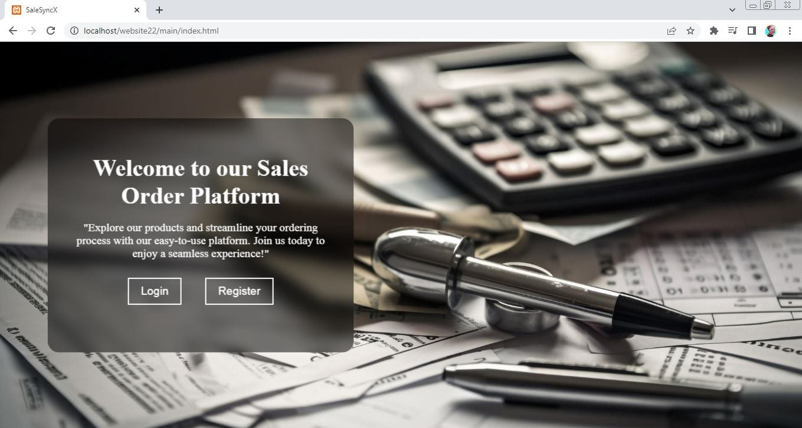
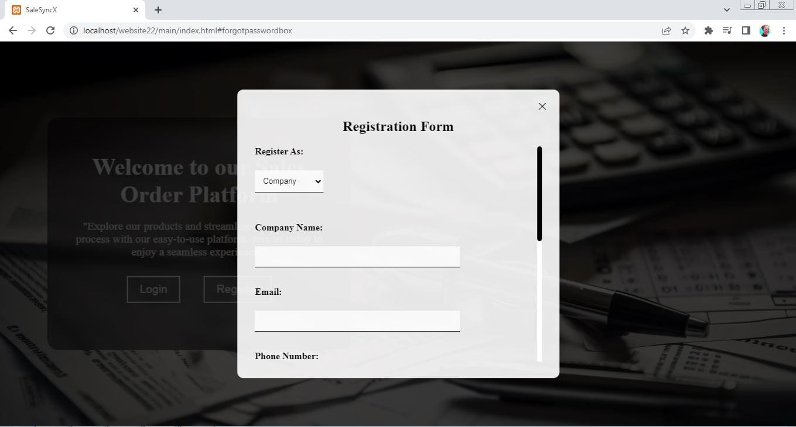
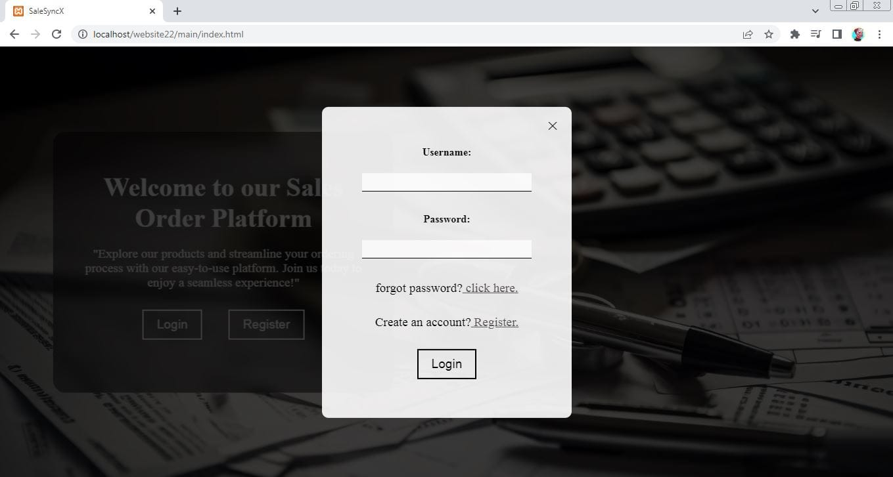
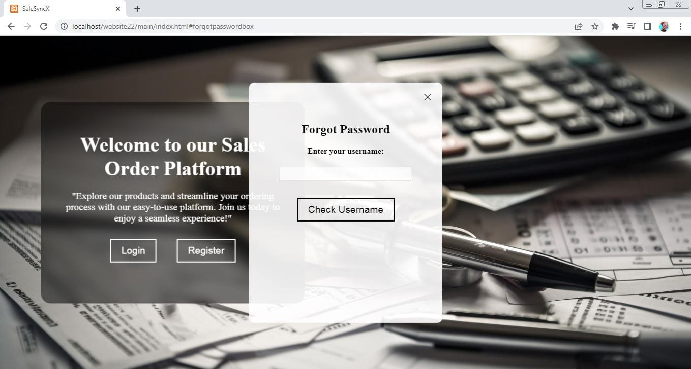
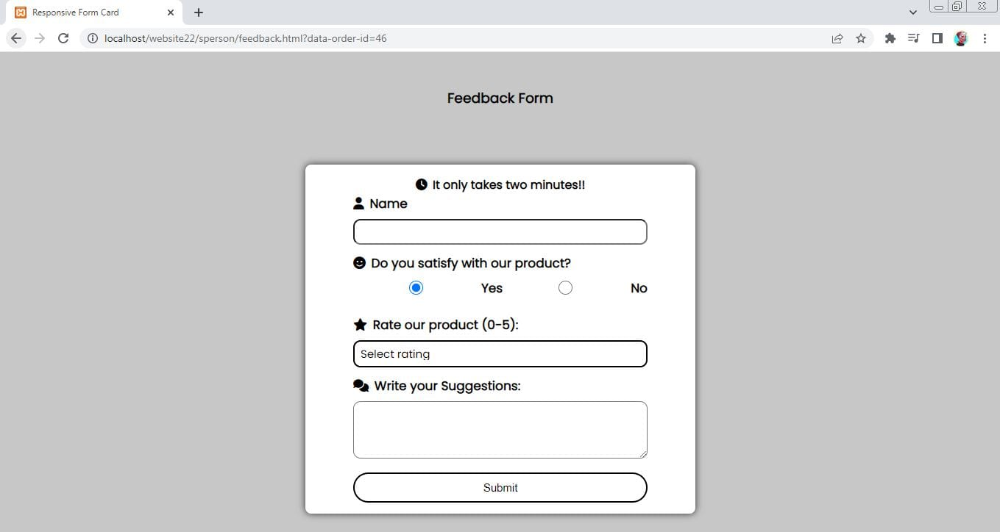
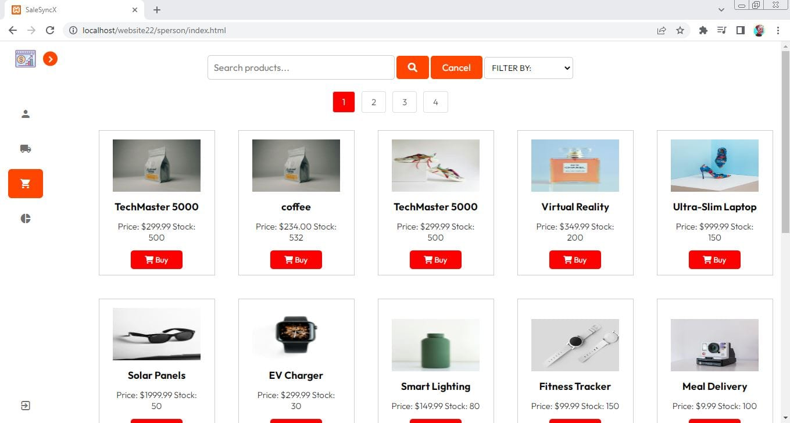
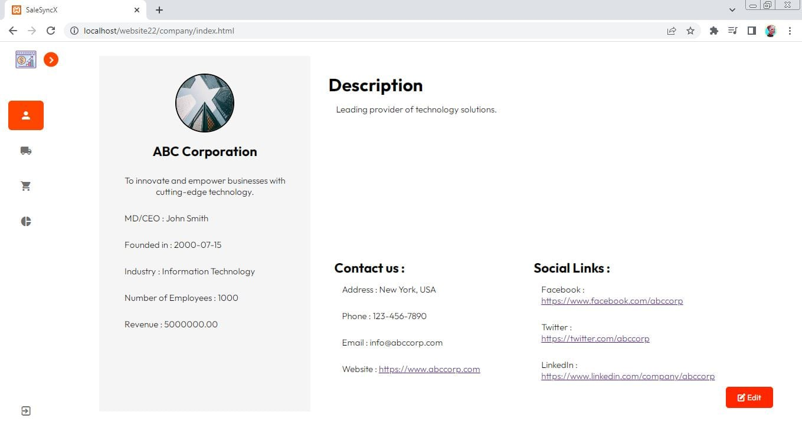
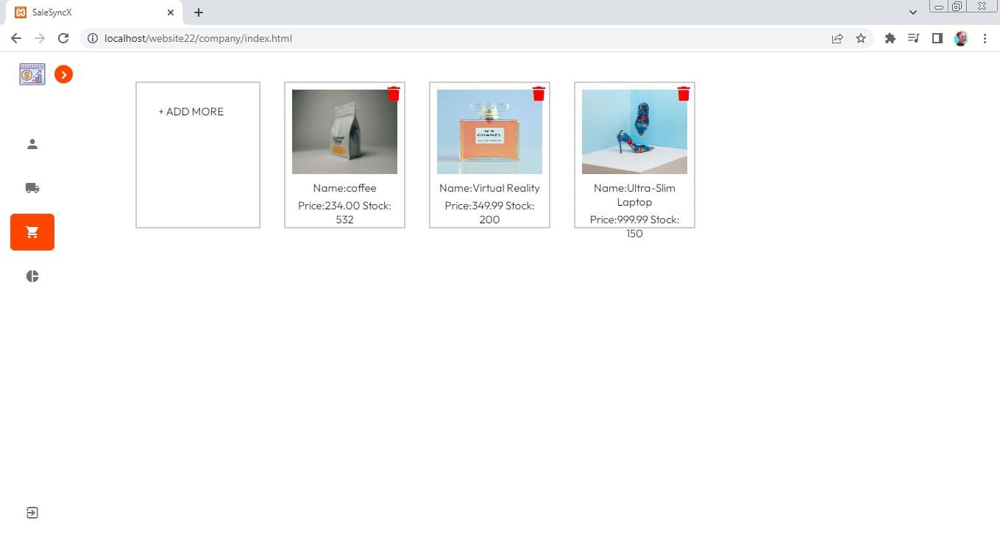
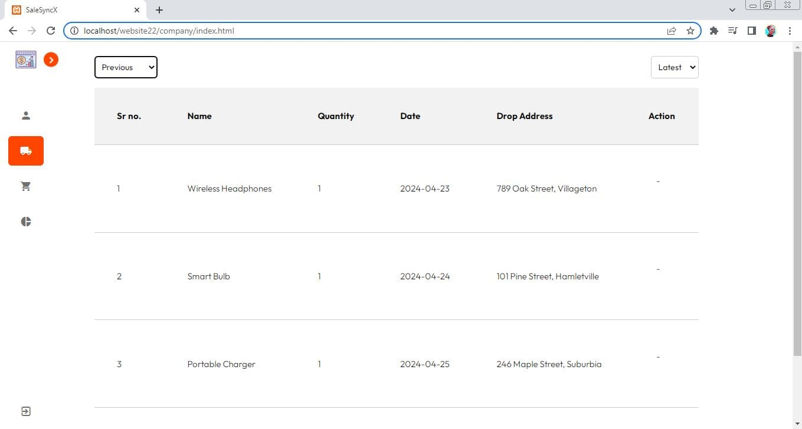
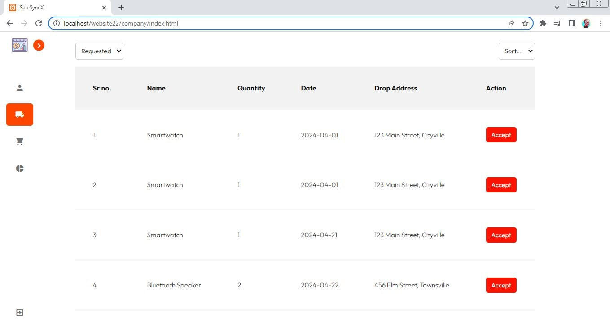
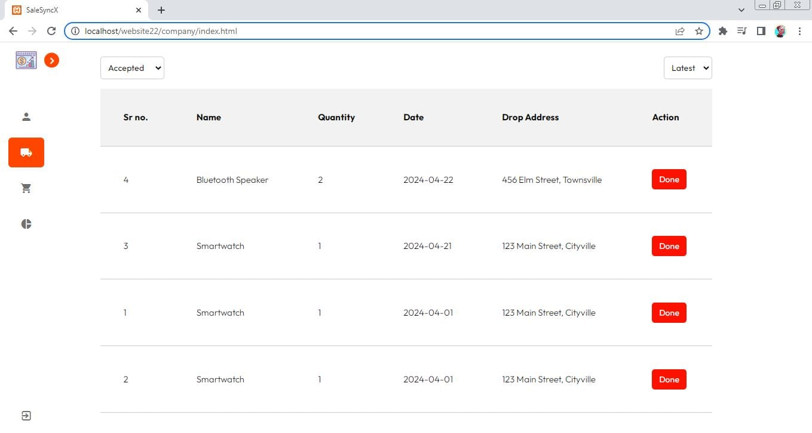
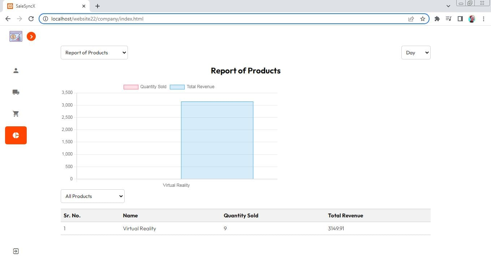
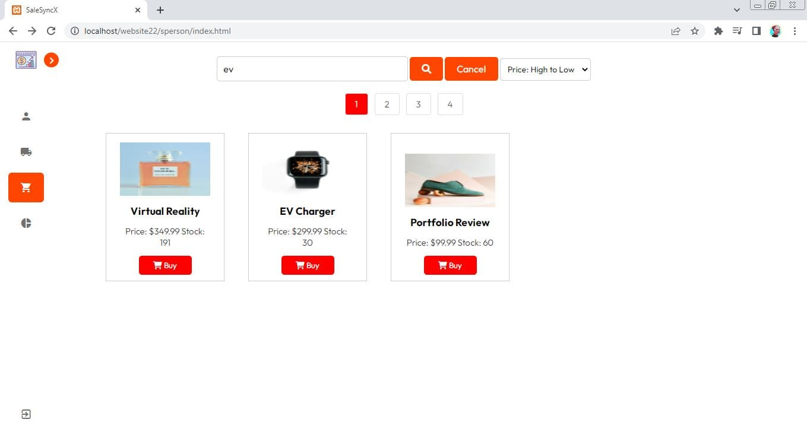

## Features
- **User Roles**: 
  - **Company**: Can view and analyze all orders placed by salespersons.
  - **Salesperson**: Can place orders and view their order history and analysis.
- **Order Management**: 
  - **Place Orders**: Salespersons can place new orders.
  - **Order History**: Both roles can view the history of orders.
- **Data Analysis**: 
  - **Charts and Graphs**: Historical order data is visualized using Chart.js for easy analysis.
- **Email Notifications**: Order confirmations and updates are sent using PHPMailer.

## Technologies Used
- **HTML**: For structuring the web pages.
- **CSS**: For styling the website and making it responsive.
- **JavaScript**: For adding interactivity and dynamic content.
- **PHP**: For server-side scripting and handling business logic.
- **PHPMailer**: For sending email notifications.
- **Chart.js**: For creating interactive charts and graphs.

## Installation
1. Clone the repository:
    ```bash
    git clone https://github.com/malhar-24/sales-order-website.git
    ```
2. Navigate to the project directory:
    ```bash
    cd sales-order-website
    ```
3. Set up a local server (e.g., XAMPP, WAMP) and place the project folder in the `htdocs` directory.
4. Import the database (if applicable) into your local server's database management system.
5. Configure PHPMailer by updating the email settings in the PHP scripts (e.g., SMTP server, username, password).
6. Open the website in your browser by navigating to `http://localhost/sales-order-website/main/index.html`.


## License

Feel free to contribute to this project by submitting issues or pull requests.
